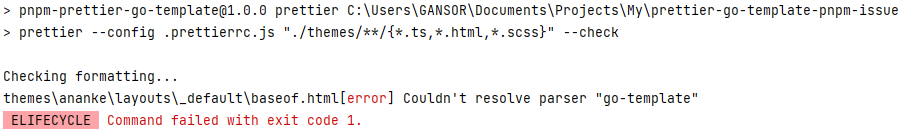

# Installation

1. Be sure you have installed `hugo`. Installation guide: [https://gohugo.io/getting-started/installing/](https://gohugo.io/getting-started/installing/)
2. Be sure you have installer `pnpm`. Installation guide: [https://pnpm.io/installation](https://pnpm.io/installation)
3. Run `pnpm install`
4. Run `pnpm prettier`

As a result got this error:

